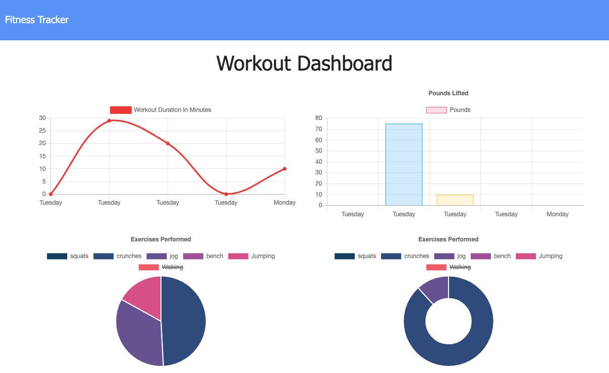

# workout-tracker

This app keeps track of the user's workouts as exercises are inputted. The app displays a weekly summary graphs of all the excersises done in that week. 

## See the deployed version in Heroku
https://protected-springs-52389.herokuapp.com/?id=602c899551b35b001568349b

## Homepage

## Summary Graphs 

